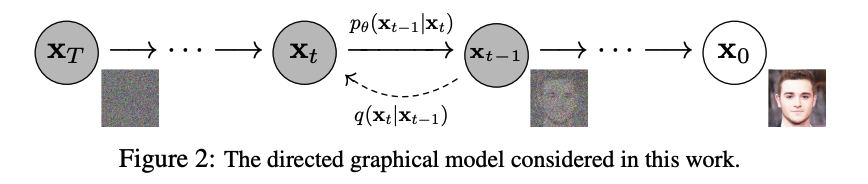
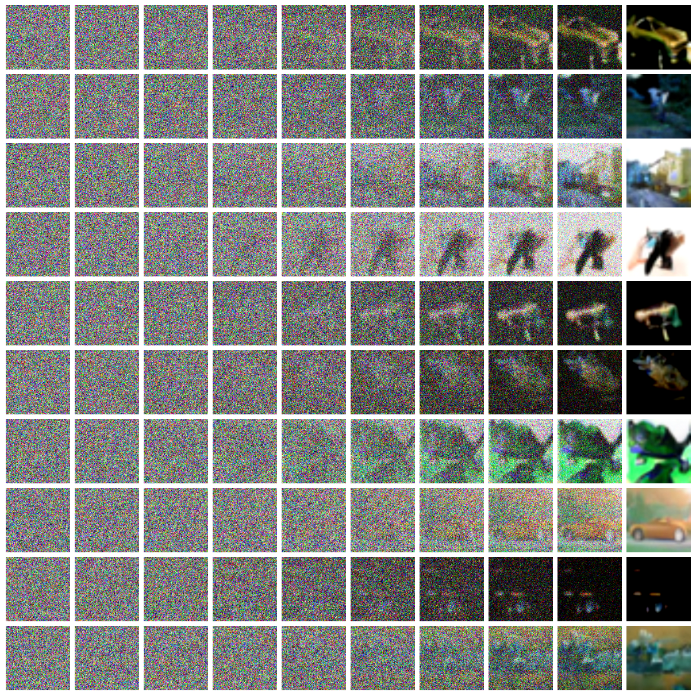

# DDPM in Pytorch

[Denoising Diffusion Probablistic Model](https://arxiv.org/abs/2006.11239)的Pytorch实现。这是一种新的生成模型方法，过程如图所示:



## 介绍

原理参考苏剑林的[博客](https://spaces.ac.cn/):

* [生成扩散模型漫谈（一）：DDPM = 拆楼 + 建楼](https://kexue.fm/archives/9119)
* [生成扩散模型漫谈（二）：DDPM = 自回归式VAE](https://kexue.fm/archives/9152)
* [生成扩散模型漫谈（三）：DDPM = 贝叶斯 + 去噪](https://kexue.fm/archives/9164)

代码实现参考:

* [Bojone Github](https://github.com/bojone/Keras-DDPM)
* [Lucidrains Github](https://github.com/lucidrains/denoising-diffusion-pytorch)
* [知乎：扩散模型之DDPM](https://zhuanlan.zhihu.com/p/563661713)

## 说明

使用CIFAR10训练数据集训练80个epoch，使用Adamw优化器，学习率5e-5，结果如图


### 1. 训练

在[config.yml](./config.yml)文件中修改训练所需要的参数

```bash
# model_path is the path to save checkpoint
python main.py --mode train --model_path model.pth
```

### 2. 推理

在[config.yml](./config.yml)文件中修改推理所需要的参数，模型配置参数要与训练时所用参数一致

```bash
# output_path is the path to save output picture, and the nums is the batch_size of generation
python main.py --mode predict --nums 10 --output_path result.png
```

## 环境

|    Package    | Version  |
| :-----------: | -------- |
| opencv-python | 4.9.0.80 |
|     torch     | 1.13.1   |
